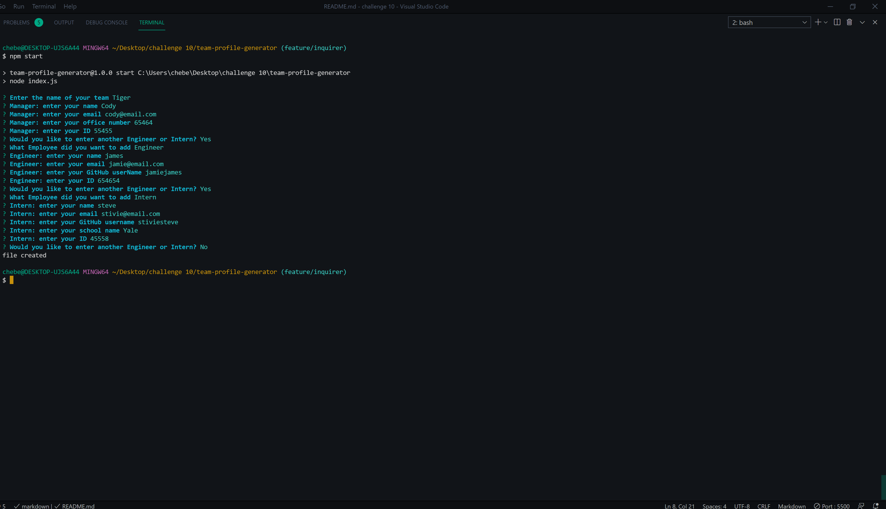

# Team Profile Generator

## Description

You are asked a series of question for Manager, Engineer and intern. fill in those questions and the program will generate an index.html file of those givin employees in a roster of the team that was created .

## Table of Contents

- [Installation](#installation)
- [Contributing](#contributing)
- [Tests](#test)
- [Links](#links)
- [Questions](#questions)
- [License](#license)
- [Author](#author)

## Installation

for installation clone the code from github and in your terminal run npm install to install the package.json file then run npm start to run the program

## Contributing

Cody Hebert contributed to this project. if anyone else would like to contribute feel free to do so.

## Tests

after installation run npm run test to test the code working properly

## Links
Video Walkthrough - https://youtu.be/PY5kN_H0rkA

https://github.com/CdHebert/profile-generator - GitHub page

## Questions

If you have any questions feel free to either email me the question:

- My email: chebert222@gmail.com

## License

## Author

Cody Hebert

